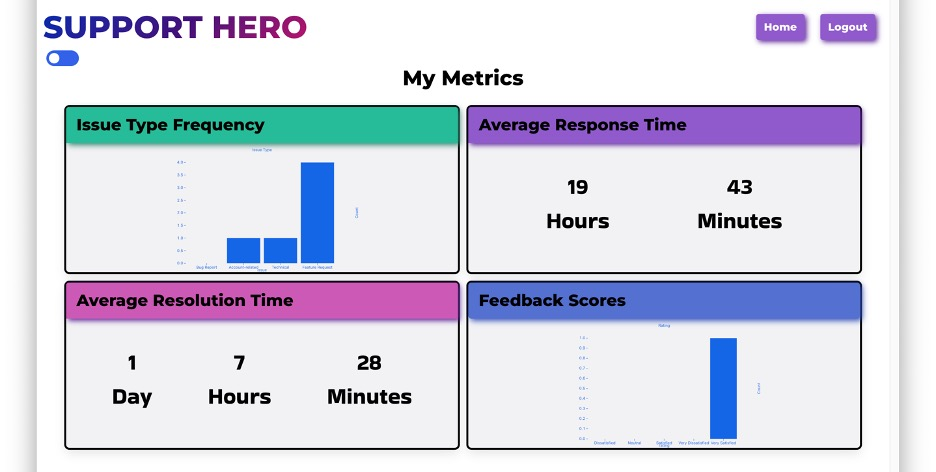

# Support Hero
## Table of Contents
- [Table of Contents](#table-of-contents)
- [Technology Used](#technology-used)
- [Description](#description)
- [Usage](#usage)
  - [Signup and Login](#signup-and-login)
  - [Homepage/Tickets](#homepagetickets)
  - [Ticket Details](#ticket-details)
  - [Metrics](#metrics)
  - [Dark Mode](#dark-mode)
  - [Email Notifications](#email-notifications)
  - [Feedback](#feedback)
- [Learning Points](#learning-points)
- [Author Info](#author-info)
  - [Ryan Moscoe](#ryan-moscoe)
  - [Megan Ellman](#megan-ellman)
  - [Brandon Haskell](#brandon-haskell)
  - [Srinithi Ravichandran](#srinithi-ravichandran)
- [License](#license)

<br />

## Technology Used

| Technology Used         | Resource URL           | 
| ------------- |:-------------| 
| CSS     | [https://developer.mozilla.org/en-US/docs/Web/CSS](https://developer.mozilla.org/en-US/docs/Web/CSS)      |   
| JavaScript | [https://developer.mozilla.org/en-US/docs/Web/JavaScript](https://developer.mozilla.org/en-US/docs/Web/JavaScript)     |    
| Node.js | [https://nodejs.org/en/](https://nodejs.org/en/) |
| Path | [https://nodejs.org/docs/latest/api/path.html](https://nodejs.org/docs/latest/api/path.html) |
| Dotenv | [https://www.npmjs.com/package/dotenv](https://www.npmjs.com/package/dotenv) |
| Bulma | [https://bulma.io/](https://bulma.io/) |
| Google Fonts | [https://fonts.google.com/](https://fonts.google.com/) |
| Font Awesome | [https://fontawesome.com/](https://fontawesome.com/) |
| Bcrypt | [https://www.npmjs.com/package/bcrypt](https://www.npmjs.com/package/bcrypt) |
| ReactJS | [https://reactjs.org/](https://reactjs.org/docs/getting-started.html) |
| React Router Dom | [https://reactrouter.com/](https://reactrouter.com/en/main) |
| Javascript Web Token (JWT) | [https://jwt.io/](https://jwt.io/introduction) |
| GraphQL | [https://graphql.org/](https://graphql.org/learn/) |
| Express Web Server | [https://expressjs.com/](https://expressjs.com/en/starter/installing.html) |
| MongoDB | [https://www.mongodb.com/](https://www.mongodb.com/docs/) |
| Mongoose ODM | [https://mongoosejs.com/](https://mongoosejs.com/docs/guide.html) |
| Apollo Server | [https://www.apollographql.com/](https://www.apollographql.com/docs/apollo-server/) |
| Nodemon | [https://www.npmjs.com/package/nodemon](https://www.npmjs.com/package/nodemon) |
| React Hook Form | [https://react-hook-form.com/get-started/](https://react-hook-form.com/) |
| React Toastify | [https://fkhadra.github.io/react-toastify/](https://fkhadra.github.io/react-toastify/introduction/) |
| React Table | [https://react-table-v7.tanstack.com/](https://react-table-v7.tanstack.com/) |
| Faker | [https://fakerjs.dev/guide/](https://fakerjs.dev/guide/) |
| Nodemailer | [https://nodemailer.com/about/](https://nodemailer.com/about/) |

<br />

## Description 

[Visit the Deployed Site](https://dry-fjord-88699.herokuapp.com/)

Support Hero is a customer support ticketing system. Customers are able to sign up, create tickets, and correspond with agents on a given issue. Agents are able to correspond with customers as well as create notes on given comments. Since notes are only visible to agents, this allows agents to add important details related to the issue that they can refer back to later. Both agents and users are able to view the tickets they have either created or have assigned to them. Users can also toggle dark mode to change the color of the platform to a darker theme. Customers can even chat live with agents!

This application offers a stunning display of a variety of metrics to allow agents to track performance statistics and trends related to issue types. In addition, Support Hero automatically sends email notifications to agents and customers when a customer signs up, when a ticket is created, a comment is added to a ticket, or a ticket is closed. The Ticket Closed email includes a deep link requires the customer to log in and then redirects the customer to a feedback form. 


<br/>

## Usage 


To explore this application, you may use the following credentials:
* Agent Email: ```jaqueline_feest34@supporthero.com```
* Customer Email: ```cheyanne32@gmail.com```
* Password (same for all users): ```Password1!```

<br />

### Signup and Login

The landing page for the site is the login page for both customers and agents. As shown below, both types of users log in with an email address and a password.

<br />


<br />

Agent accounts are created by a data feed (such as from an HRIS or Active Directory system) or set up manually by an administrator. Customers can visit the Signup page from a link on the login page to create an account. Agents and customers have different permissions in the Support Hero system.

<br />

### Homepage/Tickets

Once a user signs up or logs in, they are directed to the Homepage. At the top of the Homepage is a navbar with a button to log out of the application. This navbar is present throughout the application. Users can also toggle between dark theme (shown below) and light theme.

Below the navbar is a table with the user's tickets. The table contains columns for ticket ID, title, created on date, and status. When a user clicks on a ticket, they are taken to the Detailed Ticket view for the given ticket. 

Customers can perform additional actions on the homepage:
* Create a new ticket
* Provide feedback regarding the handling of a closed ticket

<br />


<br />

Clicking the Create Ticket button opens a modal with a form for creating a new ticket (see below).

<br />


<br />

### Ticket Details

The Ticket Details page shows the title, status, priority, issue type, and description for the ticket. The comment history shows a chronological record of comments posted to the ticket by the customer and the agent assigned to handle the case. A form at the bottom of the page allows customers and agents to add new comments. The image below shows an agent view of the Ticket Details page, which incluses several components not available to customers:
* A Metrics button to display performance and issue-related statistics
* A Close Ticket button to close out the ticket when the issue is resolved
* A Customer History button that shows all tickets the customer has ever opened.
* Internal notes attached to each comment, which the agent can add, edit, and delete.

<br />


<br />

### Metrics

The Metrics page shows performance statistics and issue trends using responsive and visually appealing charts.

<br />



<br />

### Dark Mode

While a user is logged in, a toggle is accessible at the top of the page. When a user clicks the toggle, the page will change to 'dark mode'. This will change the background and the colors to darker, more muted colors. When the toggle is clicked again, the page will change back to 'light mode'. If the user logs out and back into the platform, the mode settings will be saved.

<br />


<br />

### Email Notifications

Support Hero sends email notifications to customers and agents for various triggers. For example, when a customer signs up for an account, the customer automatically receives an email notification. In the future, this notification will be used to require an email confirmation before the customer gains full access to the system.

The example below shows an email that was sent to a customer when an agent closed a ticket. The customer can click the button in the email (or log in and navigate to the Home page or Ticket Details page) to complete a feedback survey.

<br />


<br />

### Feedback

Whether by clicking the button in the ticket closed email or by navigating manually, customers can complete a feedback survey when a ticket is closed. The system allows the customer to complete the survey only once for each ticket and only when the ticket is closed.

<br />


<br />

## Learning Points 

* React Context to render dark mode throughout the platform.
* React Hook Form to create forms with validation with minimal code.
* React Toastify to create pop-up 'toast' notifications.
* React Table to create tables with filtering capabilities.
* Nodemailer to send emails
* React routing with query parameters

<br />

## Author Info

### Ryan Moscoe 

* [Portfolio](https://rmoscoe.github.io/my-portfolio/)
* [LinkedIn](https://www.linkedin.com/in/ryan-moscoe-8652973/)
* [Github](https://github.com/rmoscoe)

<br />

### Megan Ellman
* [LinkedIn](https://www.linkedin.com/in/megan-ellman/)
* [GitHub](https://github.com/megellman)
* [Portfolio](https://megellman.github.io/portfolio/)

<br />

### Brandon Haskell
* [LinkedIn](https://www.linkedin.com/in/brandon-haskell/)
* [GitHub](https://github.com/bhaskell7901)
* [Portfolio](https://bhaskell7901.github.io/react-portfolio/)

<br />

### Srinithi Ravichandran
* [LinkedIn](https://www.linkedin.com/in/srinithi-ravichandran-18891243/)
* [GitHub](https://github.com/srinithi19)
* [Portfolio](https://srinithi19.github.io/react-portfolio/)


<br />

## License

[MIT License](https://choosealicense.com/licenses/mit/)